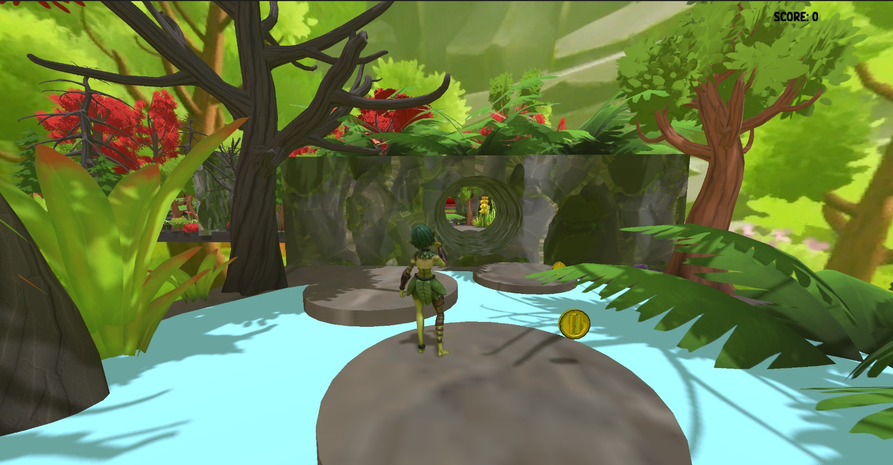
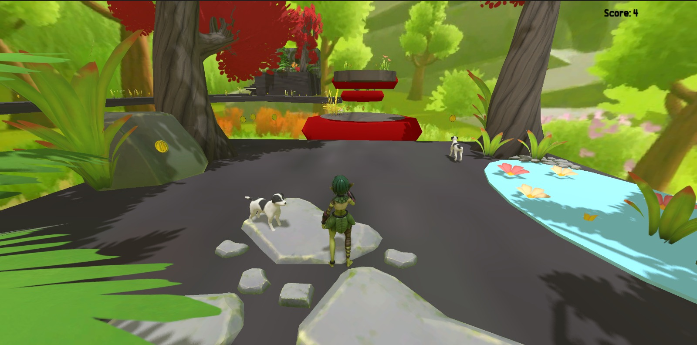
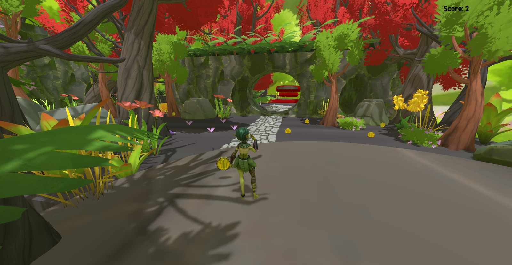

# Godot 3D Platformer

A 3D platformer game developed in Godot Engine featuring collectibles, enemies, moving platforms, and score tracking.

## Features

- Coin collection system
- Score tracking UI
- Enemy AI that follows the player
- Moving platforms
- Game Over system
- Background music
- Coin collection sound effects

## Gameplay

The player explores a fantasy forest environment while collecting coins and avoiding enemies. The score is displayed on the screen and increases as coins are collected. Falling from high places or touching enemies triggers a Game Over and restarts the game.

## Engine

- Godot Engine

## Gallery

### Gameplay 1

### Gameplay 2

### Gameplay 3

